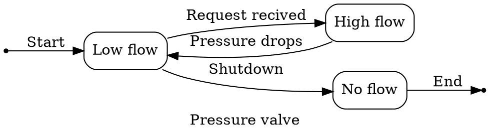

## C4

### Using `graphviz`

[Graphviz](https://graphviz.org/) is a powerful open source graph visualization tool written in (mostly) C that allows you
to define graphs using the `dot` language.

I did not find any good pre-defined templates for making C4 diagrams using Graphviz so I have written my own. As I have also made a bunch of other diagrams in this course using the `dot` language I wanted to keep the graphing language consistent. You can have a look at one example here:





The above code generates this figure:


### Using `plantUML`

[PlantUML](https://plantuml.com/) is a Java tool for drawing a wide range of diagrams, notably
[Unified Modeling Language (UML)](https://en.wikipedia.org/wiki/Unified_Modeling_Language) and
similar diagrams. 

There is a predefined set for drawing specifically C4-architecture diagrams called [C4-PlantUML](https://github.com/plantuml-stdlib/C4-PlantUML) that you can include into your PlantUML files by

```plantuml
!include <C4/C4_Container>
```

To read more on how to use C4-PlantUML, see the [github README.md](https://github.com/plantuml-stdlib/C4-PlantUML?tab=readme-ov-file#getting-started).

### Other tooling

There is an extensive list of other tooling for C4 listen on [c4model.com's tooling page](https://c4model.com/tooling).

## State diagrams

A state diagram is fairly simple to draw. If we follow the [UML definition](https://en.wikipedia.org/wiki/UML_state_machine) we can draw them:

- [Using `plantUML`](https://plantuml.com/state-diagram)

### Using `graphviz`


